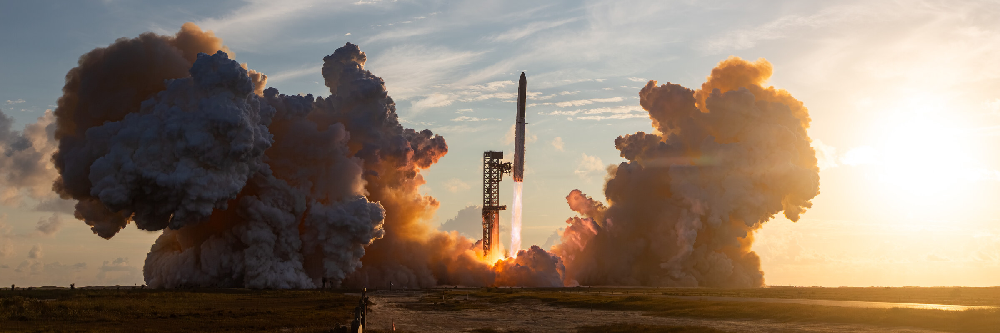
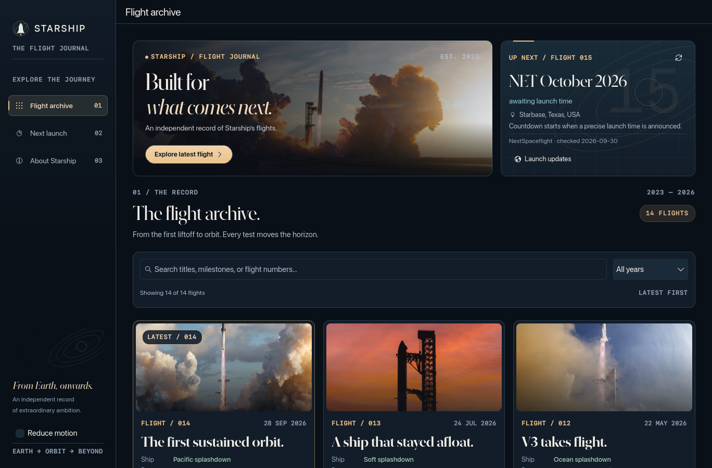
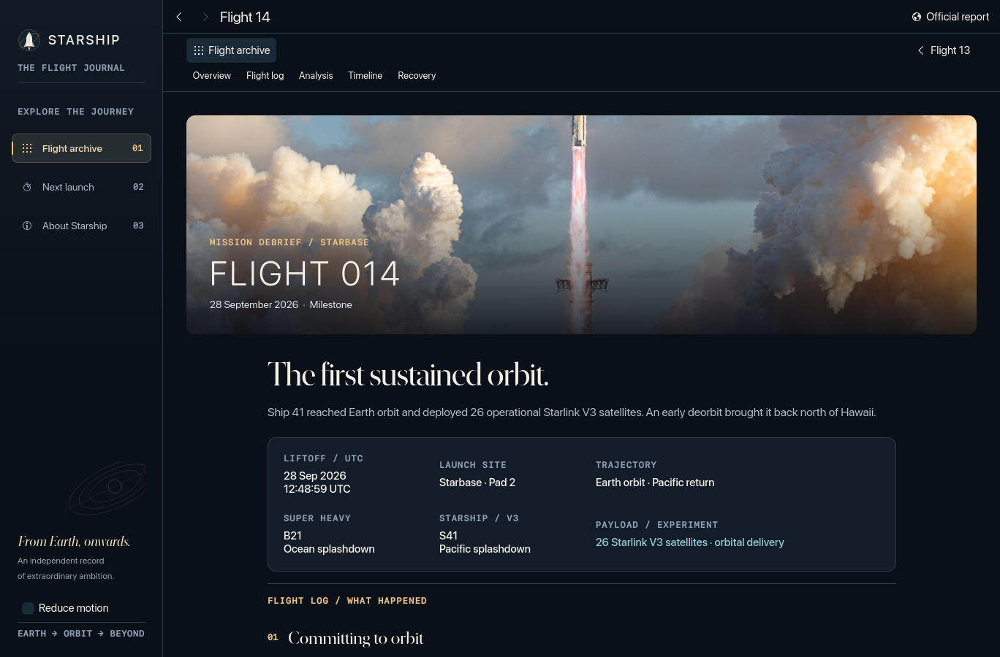
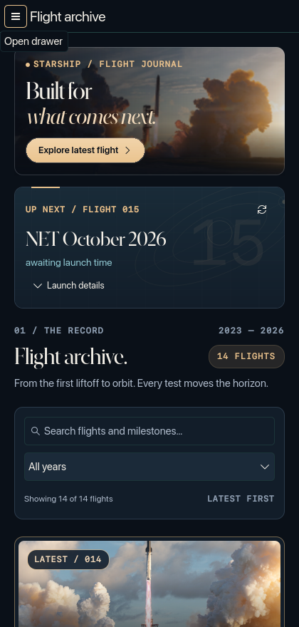
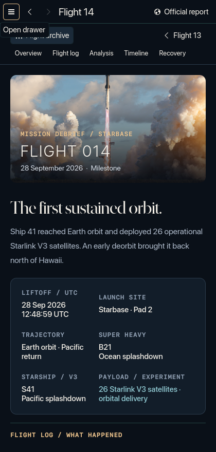
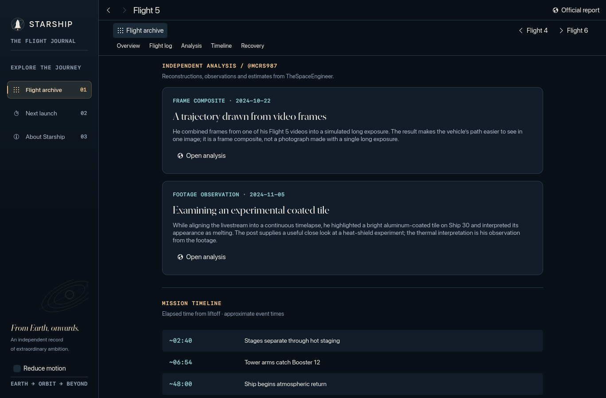
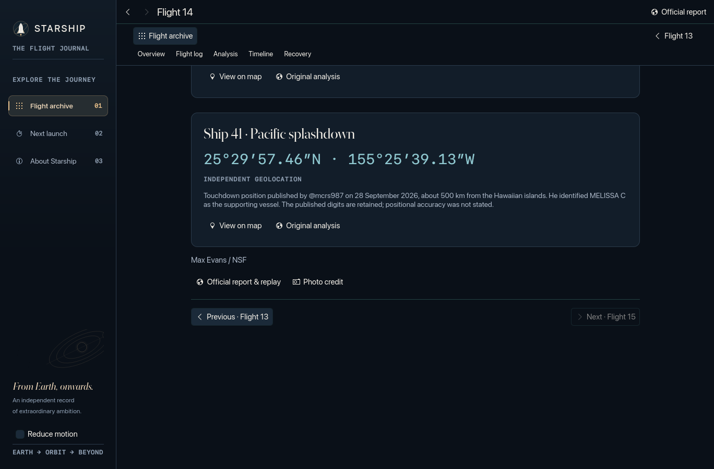
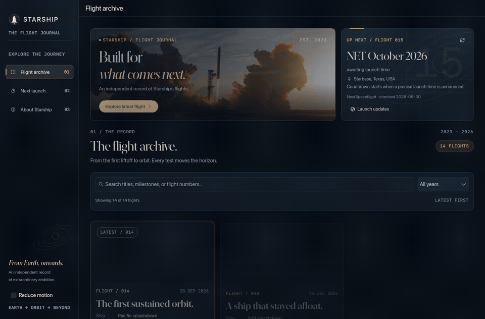
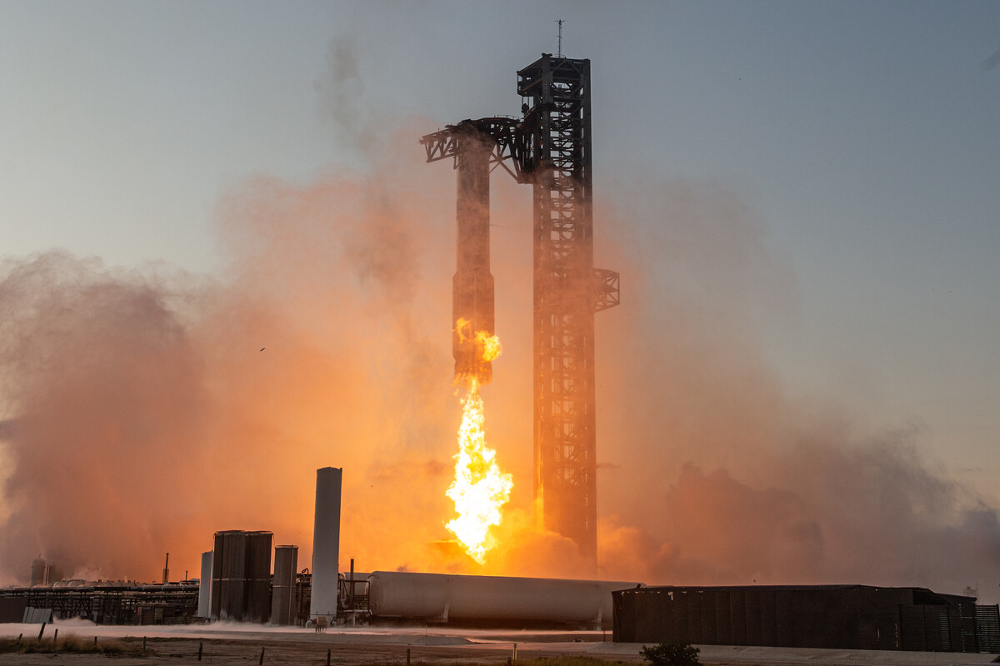

# Starship

A native desktop archive of Starship's integrated flights, built with **Rust, Qt 6, and KDE Kirigami**. Explore the flight archive, read mission debriefs, and follow the next launch in an interface shaped by spaceflight photography, orbital diagrams, and a navy-and-gold palette.



*Flight 14 photography by [Max Evans / NSF](https://maxevans.smugmug.com/Rockets/SpaceX/Starship-Flight-14/i-gTxZJ8F).*

[Download builds](https://github.com/cube-one-ber/Starship/releases) · [Build from source](#build-from-source) · [Photo credits](#photography-and-credits) · [Build and release details](docs/building.md)

## Explore Starship

- **Flight archive:** integrated Flights 1–14, with search, year filters, separate Ship and Booster results, and photographic cards. Early prototype hops are outside the archive.
- **Mission debriefs:** vehicle serials, UTC liftoff times, payloads, flight logs, approximate timelines, section shortcuts, previous/next-flight navigation, and links to official reports and replays.
- **Independent analysis:** 26 entries across all 14 flights, including reconstructions, footage studies, hardware surveys, and recovery tracking. [Browse the source index](docs/mcrs987-flight-index.md).
- **Landing locations:** sourced impact estimates and independent geolocations, with precision labels, maps, and links to the original analysis.
- **Next launch:** a refreshed launch window, expandable details in narrow archive windows, and a countdown when a precise, confirmed liftoff time is available.
- **Adaptive interface:** a compact header and three-column archive that becomes a single column in narrow windows, readable metadata, preserved filters and scroll position when returning from debriefs, keyboard navigation, and a persistent **Reduce motion** setting.
- **Windows presentation:** a dark native title bar, consistent navy-and-gold controls, bundled navigation icons, and panels whose spacing remains stable across native styles. Comparison selectors and mission facts adapt to narrow windows.
- **Bundled archive:** flight data, photos, fonts, and the application color scheme ship with the executable; schedule refreshes use the network.

### Flight archive



### Mission debrief



### Smaller windows

<p>
  
  
</p>

<details>
<summary>View independent analysis, landing-coordinate panels and motion preview</summary>







Animations follow the desktop animation-speed setting through Kirigami's standard durations. **Reduce motion** finishes pending transitions immediately and persists between runs.

</details>

## Download

The [Releases page](https://github.com/cube-one-ber/Starship/releases) contains commit prereleases produced after the Windows, Linux, and macOS build and package checks pass. Packages bundle Qt, Kirigami, icons, and JPEG XL runtime dependencies. Release downloads include SHA-256 checksums.

| Platform | Packages | Run |
| --- | --- | --- |
| Windows 10/11 x64 | Portable ZIP | Extract the entire ZIP and open `starship-journal.exe`. Keep its runtime folders and DLLs alongside it. |
| Linux x86_64 | AppImage, tar.gz, DEB, RPM | Run the AppImage, use `AppRun` in the extracted archive, or install a distribution package. Requires glibc 2.41 or later. |
| macOS Apple Silicon | DMG, app bundle ZIP | Drag the app from the DMG to Applications, or extract the ZIP. Check the release notes for the minimum macOS version. |

macOS development builds use an ad-hoc signature and are not Apple-notarized. See [build and release details](docs/building.md) for platform compatibility, packaging, and CI checks.

## Build from source

Run the following commands from the repository root. Building requires a Rust toolchain supporting edition 2024, a C++ compiler, pkg-config, Qt 6 development tools and libraries (Quick, Quick Controls, and Widgets), Kirigami, a KDE controls style, and **libjxl 0.10 or later**.

### Linux

On Arch Linux, install the native dependencies:

```sh
sudo pacman -S --needed rust gcc pkgconf qt6-base qt6-declarative kirigami qqc2-desktop-style qqc2-breeze-style libjxl
cargo run --release --locked
```

The executable is `target/release/starship-journal`. If Qt discovery needs help:

```sh
QMAKE=/usr/bin/qmake6 cargo run --release --locked
```

For an Arch checkout, you can also cache the official Breeze controls locally instead of installing `qqc2-breeze-style`:

```sh
python scripts/prepare/prepare-native-style.py
```

This helper requires pacman, curl, and bsdtar. It stores the unmodified runtime in the ignored `target/runtime/` directory and records its source, license, and SHA-256. The app discovers local or installed Breeze controls automatically, with qqc2-desktop-style as a fallback. `QT_QUICK_CONTROLS_STYLE` overrides the default.

To build Linux distribution packages, use `bash scripts/build/build-linux.sh` in a prepared Debian 13 build environment. The [CI workflow](.github/workflows/builds.yml) lists the required Debian packages.

### Windows

Install MSYS2, open its **UCRT64** terminal, and finish updating with `pacman -Syu`. Then install the project's SDK packages and build:

```sh
mapfile -t packages < <(tr -d '\r' < packaging/windows/packages.txt)
pacman -S --needed --noconfirm "${packages[@]}"
bash scripts/build/build-windows.sh
```

The script uses the MSYS2 Rust/GNU toolchain, runs backend tests, and produces `dist/Starship-Journal-windows-x64.zip`. Packaging uses Qt's `windeployqt` and checks recursive DLL dependencies.

### macOS

On Apple Silicon, install Rust and the Homebrew build dependencies:

```sh
brew install cmake ninja pkgconf qtbase qtdeclarative qtsvg qtshadertools qttools jpeg-xl
bash scripts/build/build-macos.sh
```

The script builds the pinned KDE dependencies, runs backend tests, and creates app bundle ZIP and DMG packages in `dist/` using Qt's `macdeployqt`.

## Flight data and launch timing

The archive is curated in [`resources/data/flights.json`](resources/data/flights.json). Research sources, coordinate provenance, and editorial precision notes are recorded in the [content source ledger](docs/content-sources.md). Flight histories need editorial updates after future flights.

The schedule adapter reads structured launch data embedded in NextSpaceflight's public Starship pages on startup, every ten minutes, and on manual refresh. It checks the next numbered flight against its detail page. This depends on the website's format; a failed request or parsing change falls back to the saved NextSpaceflight schedule or the [bundled snapshot](resources/data/schedule.json).

Only a confirmed minute- or second-precision launch time with **Go** status starts the countdown. Tentative days, months, quarters, and years remain launch windows; holds, scrubs, and withdrawn windows clear the countdown. Schedule updates run in a background Rust thread and are saved atomically in Qt's platform cache directory.

Coordinates preserve their sources' stated precision. Independent geolocations and impact estimates are labeled accordingly; preflight targets and post-landing drift positions are not presented as touchdowns.

## Photography and credits

**Independent analysis and geolocation:** [The Space Engineer (@mcrs987)](https://x.com/mcrs987), whose reconstructions, observations, and location estimates inform the flight archive.



*Flight 5 photography by [Max Evans / NSF](https://maxevans.smugmug.com/Rockets/SpaceX/Starship-IFT-5/i-TFcrWJ2).*

The archive includes 13 selected photographs from **Max Evans / NSF** (12 flight images and the hero), downloaded with gallery-dl. Flights 4 and 7 use credited **SpaceX** photography. Source URLs and credits are recorded in [`assets/archive/selection.json`](assets/archive/selection.json) and [`resources/data/photos.json`](resources/data/photos.json).

| Location | Contents |
| --- | --- |
| `assets/archive/originals/` | Original JPEG downloads |
| `assets/archive/jxl/` | Losslessly recompressed archival JPEG XL files |
| `resources/photos/` | Resized JPEG XL images and JPEG fallbacks |
| `resources/images/` | SpaceX images for Flights 4 and 7 |
| [`assets/archive/conversion-report.json`](assets/archive/conversion-report.json) | Source URLs, original hashes, and size comparisons |

The native image provider decodes JPEG XL with libjxl and uses JPEG fallbacks on image errors. The photo preparation script verifies that archival JPEG XL files reconstruct the original JPEG bytes exactly. To reproduce downloads and conversion, install gallery-dl, ImageMagick, cjxl, and djxl, then run:

```sh
python scripts/prepare/prepare-photos.py
```

**Typography:** bundled SF Pro, SF Mono, and New York fonts are registered from Qt resources. Their file origins and hashes are recorded in [`resources/fonts/provenance.json`](resources/fonts/provenance.json). The `Starship.colors` scheme applies to this app without changing desktop settings.

Photographs remain the property of their credited photographers. The bundled Apple fonts remain proprietary and retain their original terms. This project is unaffiliated with SpaceX or NASASpaceflight.

## Development and verification

Rust owns the archive, filtering, schedule normalization, countdown, and networking. CXX-Qt connects the backend to the QML interface; a small C++ image provider handles JPEG XL decoding.

| Path | Purpose |
| --- | --- |
| `src/domain.rs` | Flight data, filtering, launch parsing, countdown logic, and domain tests |
| `src/backend.rs` | Qt bridge, background refresh, and cache updates |
| `qml/` | Kirigami pages, cards, mission reports, and animations |
| `resources/data/` | Curated flights, photo metadata, and schedule snapshot |
| `docs/` | Research ledger, build guide, and application previews |
| `scripts/` | Asset preparation, platform builds, packaging, and portable checks |
| `docs/previews/` | Captured application screenshots and motion preview |

See [the directory guide](docs/structure.md) for the complete layout and where to add source files, resources, and platform tools.

Run backend and packaging tests:

```sh
cargo test --locked
python -m unittest discover -s tests/packaging -v
```

On Linux, `bash scripts/check/check-native.sh` runs backend tests, builds the app, and exercises the desktop and narrow QML layouts. To run the smoke checks directly, including reduced motion:

```sh
cargo build --locked
QT_QPA_PLATFORM=offscreen QT_QUICK_BACKEND=software ./target/debug/starship-journal --smoke-test
QT_QPA_PLATFORM=offscreen QT_QUICK_BACKEND=software ./target/debug/starship-journal --smoke-test --narrow-test
QT_QPA_PLATFORM=offscreen QT_QUICK_BACKEND=software ./target/debug/starship-journal --smoke-test --reduce-motion
```

Smoke checks cover filtering, empty results, keyboard focus, interrupted mission transitions, navigation, reduced motion, panel padding, selector popups, and all 14 mission images. The native check script also exercises the Windows control style on Linux; add `--bundled-icons` to use the app's Windows icon theme. Screenshots are written to the platform temporary directory; set `STARSHIP_TEST_OUTPUT_DIR` to choose a destination and `QT_FORCE_STDERR_LOGGING=1` to print Qt diagnostics. Add `--motion-preview` to capture 140 numbered frames for a GIF or video.

The optional live schedule test makes network requests:

```sh
cargo test --locked live_nextspaceflight_schedule -- --ignored --nocapture
```

To verify an extracted Windows package from PowerShell:

```powershell
./scripts/check/check-windows.ps1 -PackagePath 'C:/path/to/Starship-Journal-windows-x64'
```

The Windows check captures desktop and narrow layouts at 100% and 150% display scaling, and rejects malformed icon paths, page creation warnings, and binding loops. Scaled screenshots are saved in a separate `dpi-150/` directory.

[CI](.github/workflows/builds.yml) builds and checks portable packages on all three platforms before publishing commit prereleases. See [the build guide](docs/building.md) for the complete release process.
